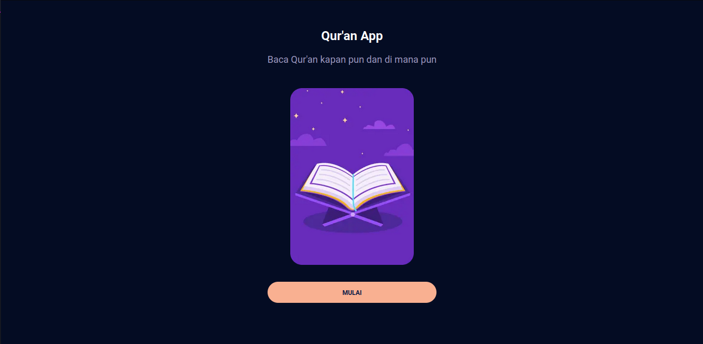
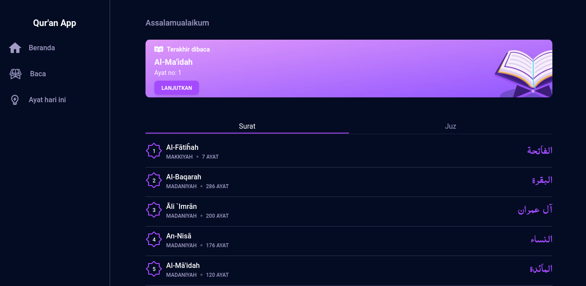

# Quran App
A web based app to read Qur'an everywhere as long as there is internet connection.

## Screenshot

  

## Motivation
There's no any special motivation. I created this project for personal use.

## Features
- Read Qur'an
- Mark latest read
- Daily random verse

## Tech Stack
- [Next.js](https://github.com/vercel/next.js)
- [Tailwind CSS](https://github.com/tailwindlabs/tailwindcss)  
- [Material Tailwind](https://github.com/creativetimofficial/material-tailwind)

## Installation  
Create environment file based on provided example.
```sh
cp .env.example .env
```

### Without Docker 
*Next.js 14 requires Node.js 18.17 (minimum), so make sure it's installed in your operating system.*  

Install dependencies.
```sh
yarn
```  

Run as development.
```sh
yarn dev
```

Build as production.
```sh
yarn build
```  

Run as production.
```sh
yarn start
```  

## With Docker  

Run as development.
```sh
docker compose up
```  

Run as production.
```sh
docker compose -f ./docker-compose.production.yml up -d
```

## Tests
```sh
yarn test
```

## Credits
- Design inspiration and asset is from [Quran App Concept](https://www.figma.com/community/file/966921639679380402)  
- Qur'an API is from [Quran.com v4 api](https://quran.api-docs.io/v4/getting-started/introduction)
